📄 Planeación del Sistema en Jira
Desglose de trabajo: Épicas, Historias de Usuario y Tareas

La implementación de los requerimientos identificados de Bankify se desglosa de la siguiente manera:
1. Épica:
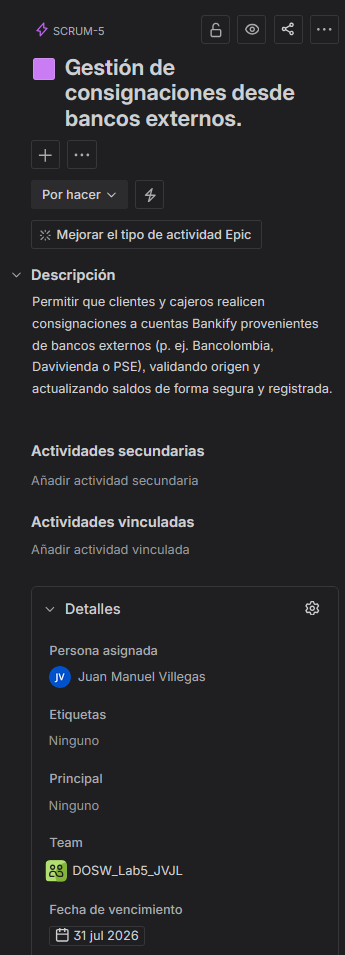

2. Historias de usuario:
## Historia 1

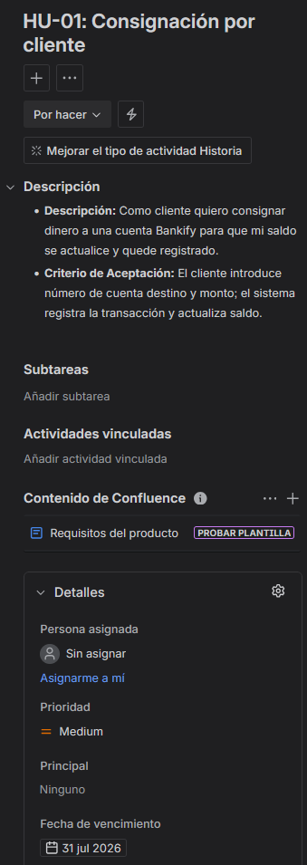

## Historia 2

## Historia 3  

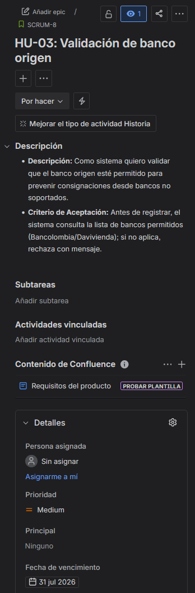

## Historia 4 

3. Tareas:

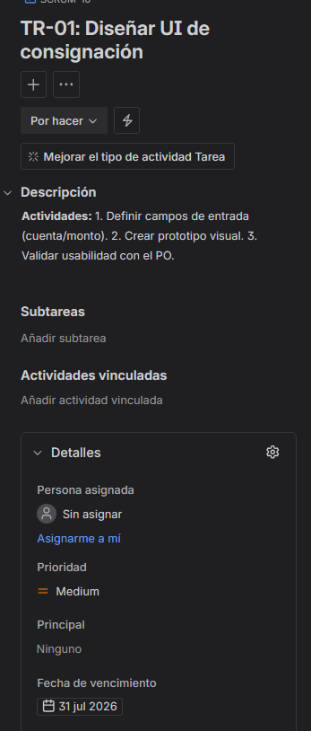

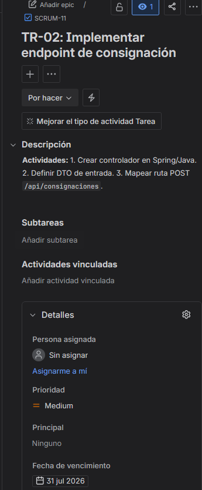

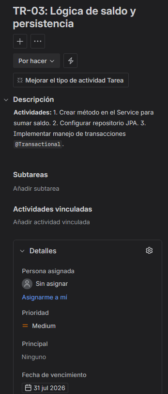

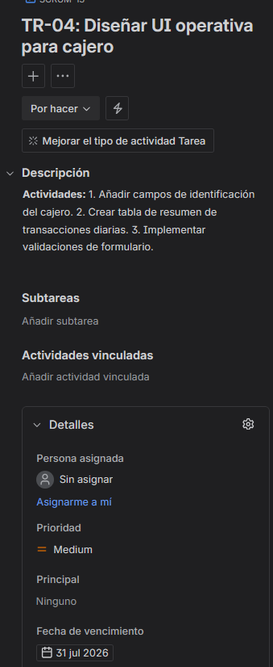

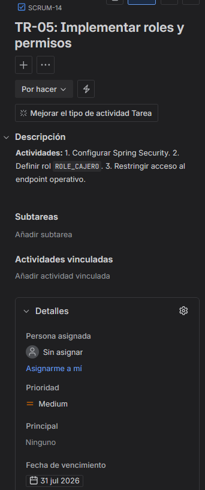

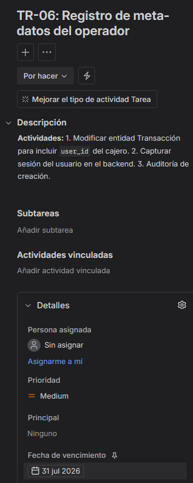

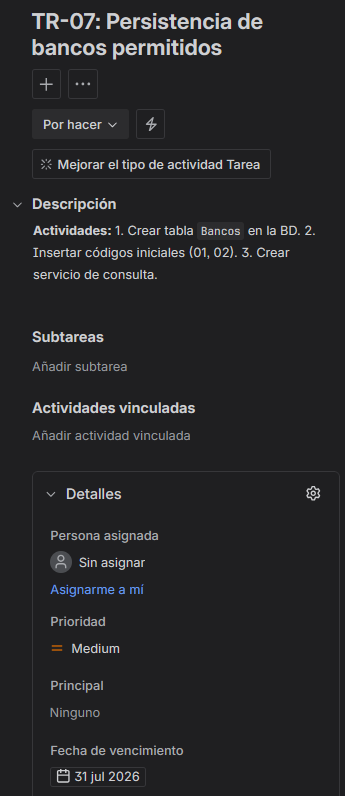

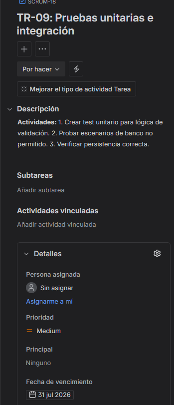

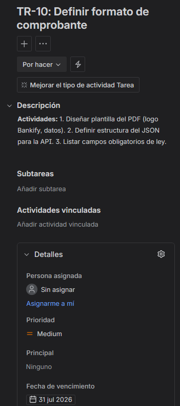

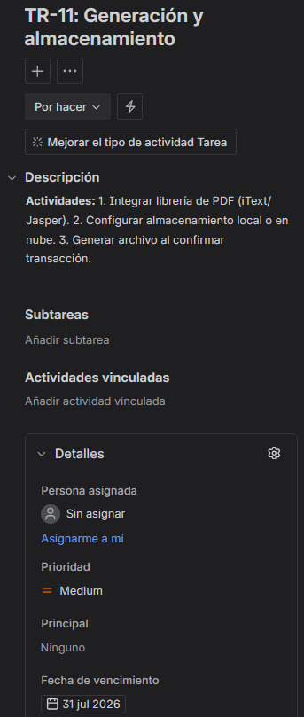

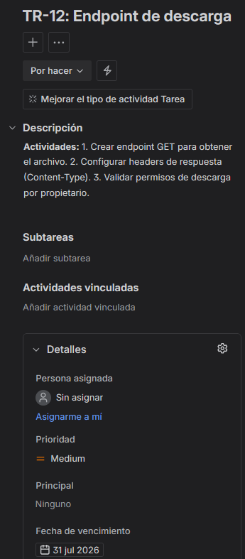

4. Cronograma:

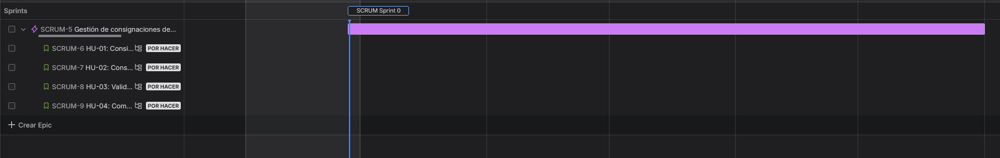

5. Backlog:

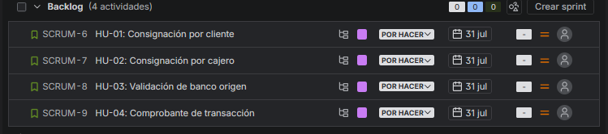

6. Sprint Backlog

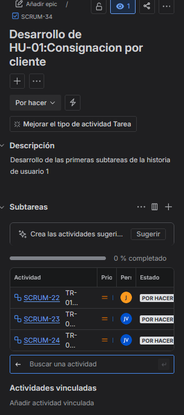

Para este primer sprint, decidimos priorizar exclusivamente la HU-01: Consignación por cliente (SCRUM-6) por ser la funcionalidad crítica que habilita la operación de Bankify. Al ser un equipo de dos integrantes, optamos por esta carga de trabajo para asegurar una arquitectura inicial robusta y realizar pruebas exhaustivas sin comprometer la calidad del código. Esta planeación nos permite gestionar de manera equilibrada las subtareas de lógica y validación ya asignadas entre Juan Jose y Juan Manuel (SCRUM-22, SCRUM-23 y SCRUM-24), garantizando un flujo de depósito totalmente operativo y seguro.
